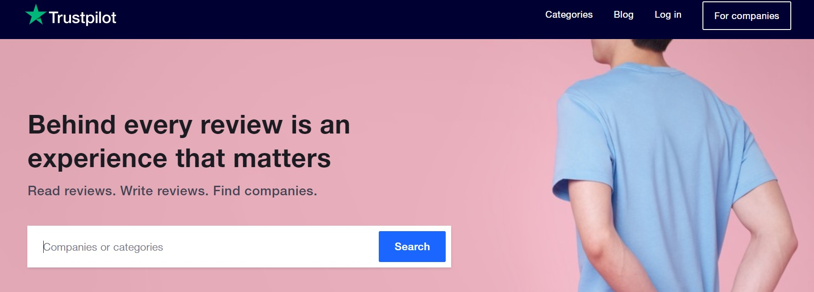
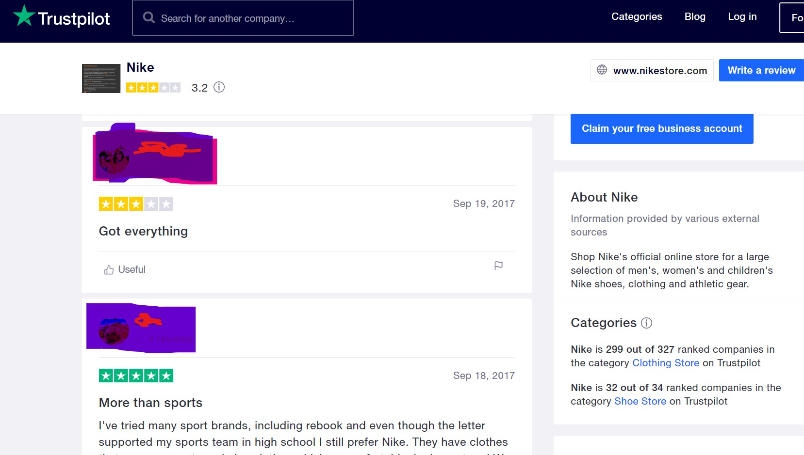

Customer review or feedback on a product or a serivce is essential source of information from the descrption of the user. Efficent use of such information, can help and identify valuable opportunities for furthur development of product or service.

[Trustpilot](https://www.trustpilot.com/) is one of the webiste which collects the reviews on various companies and services.  

 Nike onlinestore webiste was the main concentration and web scraped the reviews data from the Trustpilot website based on english language  

In this project main focus is on:
- Web scraping 
- data understanding
- data pre-processing
- EDA
- Basic NLP

Overall, The approach described above is very simple and far from its full potential. 
However, it manages to deliver some valuable insights, helps to understand customer issues and derive major points in a matter of minutes provided there are thousands of comments in various languages.
